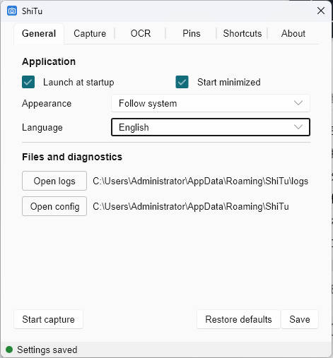
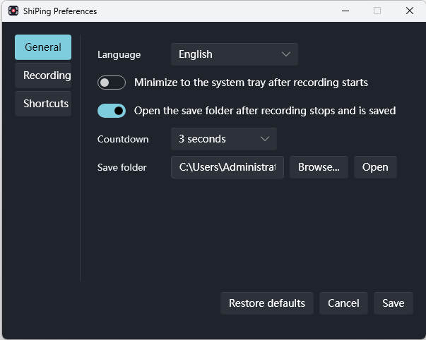

# ShiTu & ShiPing

[简体中文](README.zh-CN.md)

Two focused, offline-first Windows tools for capturing what matters and sharing it without slowing down your workflow.

- **ShiTu** turns screenshots into useful working material with capture, annotation, OCR, and pinned-image tools.
- **ShiPing** keeps screen recording direct: choose a screen, window, or region, confirm your settings, and start recording.

No account is required. Your captures, recordings, and OCR results stay on your device.

## ShiTu — capture, annotate, and keep it in view



ShiTu is built for the small screenshot tasks that happen all day: copying part of a document, explaining a UI issue, extracting text, or keeping a reference visible while you work.

- Capture a screen region or select a visible window.
- Annotate with pen, rectangle, arrow, text, and eraser tools, with undo and redo.
- Copy immediately, save as PNG/JPEG, or enable automatic saving.
- Pin screenshots above other windows and adjust zoom, opacity, and always-on-top behavior.
- Recognize text locally with Windows system OCR and copy the result.
- Start a capture from the system tray or the default `Ctrl+Alt+C` shortcut.
- Use the system theme with English or Simplified Chinese.

## ShiPing — recording without a production studio


ShiPing is designed for product walkthroughs, tutorials, meeting demonstrations, and reproducible bug reports. Its compact toolbar keeps the active recording state and the controls you need in one place.



- Record one screen, a visible window, or a fixed desktop region.
- Save as MP4 with optional system audio and microphone input, or as a silent animated GIF.
- Pause and resume without advancing the recording timeline.
- Choose automatic, 720p, 1080p, or original resolution.
- Use 30/60 FPS for MP4 and 10/20 FPS for GIF.
- Include the pointer and optionally highlight mouse clicks.
- Configure the countdown, save folder, tray behavior, and global shortcuts.
- Keep a visible recording boundary around the selected window or region until recording stops.

> **Current status:** ShiPing's first Windows recording workflow is implemented. It is ready for broader testing across multi-monitor, DPI scaling, audio-device, encoder, and long-duration recording combinations.

## What's new in v0.1.8

### ShiTu

- Eliminated the black-screen flicker that could appear when starting a capture.
- Made the selected content refresh continuously while an existing selection is dragged.
- Fixed the Save As flow that could appear to freeze when the dialog was not associated with the active application window.

### ShiPing

- Added the complete first-release flow for screen, visible-window, and region recording.
- Added MP4 recording, silent GIF output, system audio, microphone input, pause/resume, countdown, and configurable shortcuts.
- Added a persistent recording boundary, clearer recording states, muted speaker/microphone icons, and automatic restoration of the main toolbar after stopping from a shortcut.
- Added a dedicated `ShiPing.exe` release artifact alongside `ShiTu.exe`.

## Download and support

- [Download the latest release](https://github.com/dripai/shitu/releases)
- [Report a problem or request a feature](https://github.com/dripai/shitu/issues)
- [Read the privacy policy](PRIVACY.en.md)

## Privacy by design

ShiTu and ShiPing do not require an account or upload your work to a service operated by this project. Basic OCR uses Windows-provided local system capabilities. Screenshots, recordings, audio, and recognized text remain under your control.

## Build locally

Windows 10/11, Git Bash, and a stable Rust toolchain are required. The project script selects the application binary and prepares the pinned Skia binary package for the current supported platform.

```bash
# Run in development mode
./start.sh dev shitu
./start.sh dev shiping

# Build optimized executables
./start.sh build shitu
./start.sh build shiping
```

The release executables are named `ShiTu.exe` and `ShiPing.exe`.

## Current platform boundaries

- Windows 10/11 is the current supported platform.
- ShiPing records the pixels currently visible in the selected window area. Covered or off-screen window content is not captured as an independent window surface.
- ShiPing supports one selected display at a time; it does not combine multiple displays into one recording.
- Enhanced Windows AI OCR exists as an experimental path, but it has not been verified on a supported NPU device and is not presented as a verified product feature.

## For contributors

- `apps/shitu`: ShiTu screenshot, annotation, OCR, and pinning application.
- `apps/shiping`: ShiPing Windows screen recorder.
- `apps/shiyin`: planned ShiYin audio recorder; recording is not implemented.
- `crates/shi-foundation`: shared language, internationalization, configuration, and logging infrastructure.
- `crates/shi-ui`: shared Slint components.
