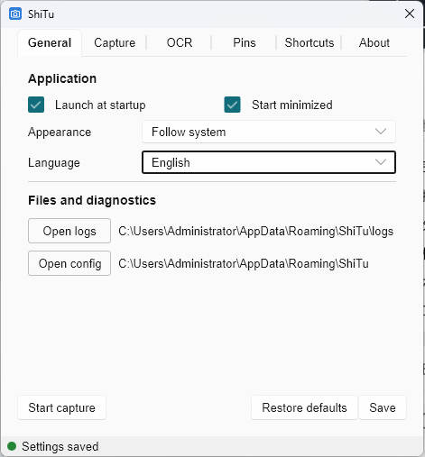

# ShiTu

[简体中文](README.zh-CN.md)

A local Windows screenshot, annotation, OCR, and pinning tool. No account is required.



ShiTu is built for the small screenshot tasks that happen all day: copying part of a document, explaining a UI issue, extracting text, or keeping a reference visible while you work.

- Capture a screen region or select a visible window.
- Annotate with pen, rectangle, ellipse, arrow, text, eraser, and mosaic tools; select, move and resize annotations, with undo and redo.
- Copy immediately, save as PNG/JPEG, or enable automatic saving.
- Pin screenshots above other windows and adjust zoom, opacity, and always-on-top behavior.
- Recognize text locally with Windows system OCR and copy the result.
- Start a capture from the system tray or the default `Ctrl+Alt+C` shortcut.
- Follow the system theme and language, or choose Simplified Chinese, English, Japanese, Korean, French, German, Spanish, Portuguese, Russian, or Hindi in General → Language. Click Save to keep the language after restarting.

See the [v0.2.0 changes](CHANGELOG.md) for themes, annotation editing, and toolbar placement.

## Download and support

- [Download the latest release](https://github.com/dripai/shitu/releases)
- [Report a problem](https://github.com/dripai/shitu/issues)
- [Privacy policy](PRIVACY.en.md)

ShiPing is maintained independently at [dripai/ShiPing](https://github.com/dripai/ShiPing).

## Build locally

Windows 10/11, Git Bash, and Rust are required. The workspace defaults to ShiTu:

```bash
./start.sh dev
./start.sh build
cargo test --workspace --locked
```

Version tags publish only ShiTu Windows x64 packages.

## Current boundaries

- ShiTu supports Windows 10/11; this migration does not add platform support.
- Enhanced Windows AI OCR remains experimental and unverified on supported NPU hardware.
- `apps/shitu` contains the application; `crates/shi-foundation` and `crates/shi-ui` are internal modules.
- `apps/shiyin` remains a planned audio recorder; recording is not implemented.
